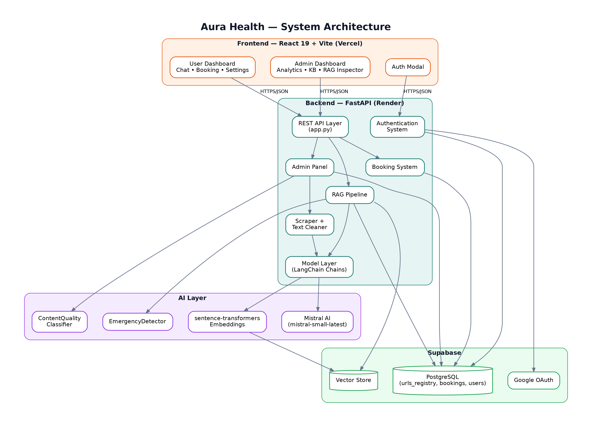
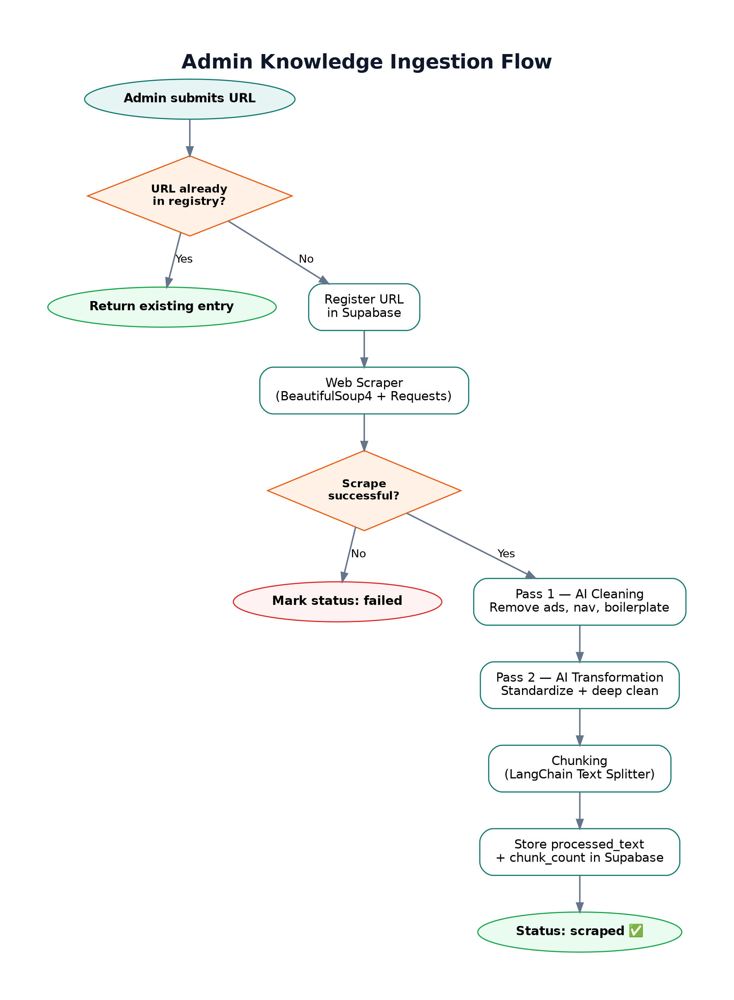
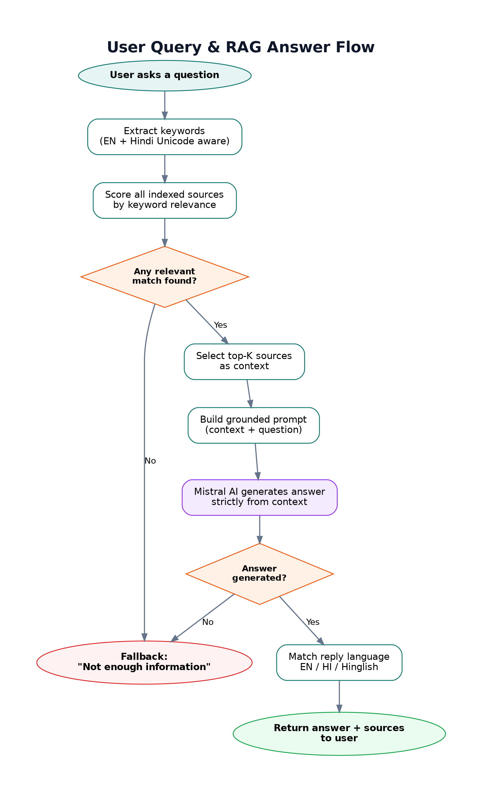
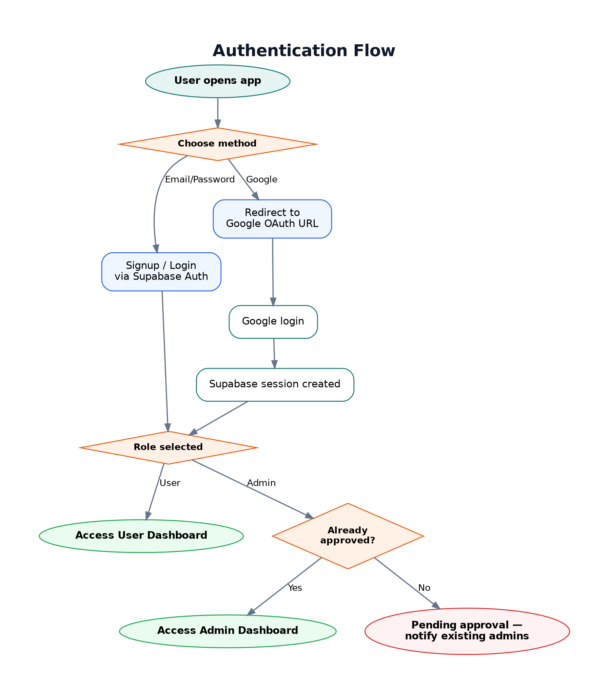
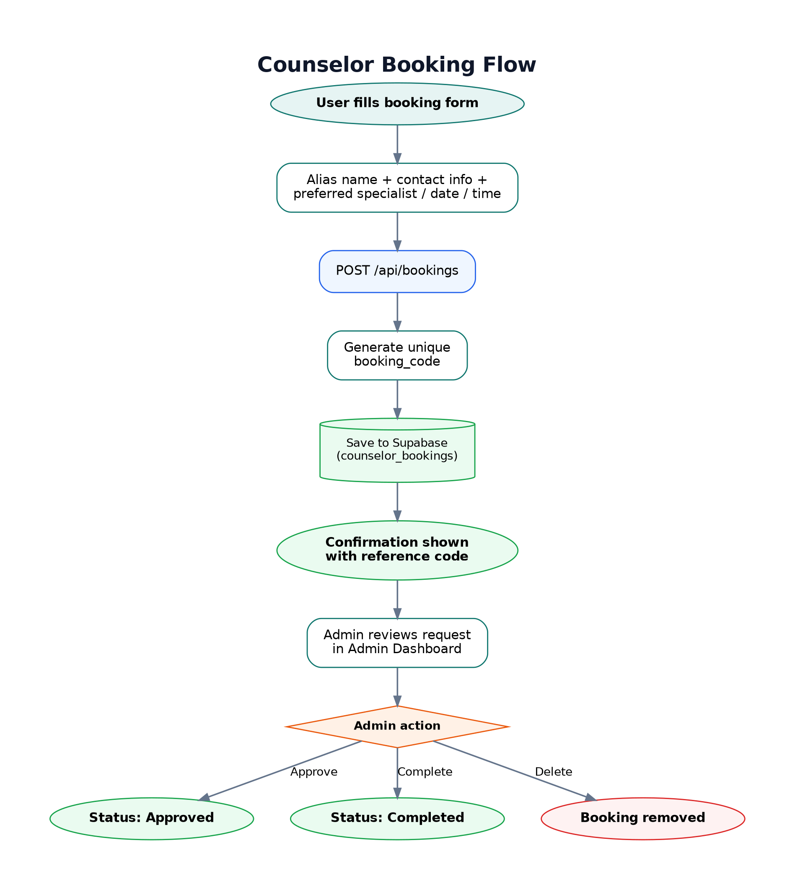
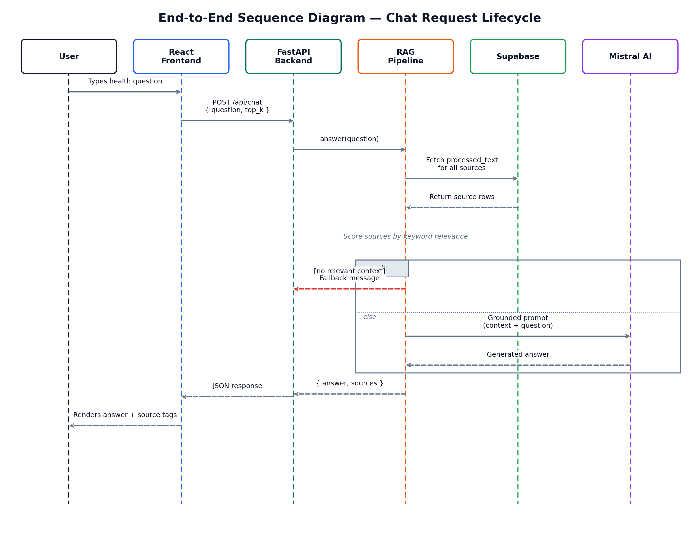

<div align="center">

# 🩺 Aura Health

### AI-Powered Public Health Awareness Chatbot

*Trustworthy health information, grounded in verified sources — available in English, Hindi, and Hinglish.*

[](https://fastapi.tiangolo.com/)
[](https://react.dev/)
[](https://supabase.com/)
[](https://mistral.ai/)
[](#-license)

[](https://render.com/)
[](https://vercel.com/)
[-orange?style=flat-square)](#)

<br/>

**[🚀 Live Demo](#)** &nbsp;•&nbsp; **[📖 API Docs](#)** &nbsp;•&nbsp; **[🐛 Report Bug](../../issues)** &nbsp;•&nbsp; **[✨ Request Feature](../../issues)**

> ⚠️ Replace the placeholder links above with your actual deployed Vercel/Render URLs before publishing.

</div>

---

## 📑 Table of Contents

- [About the Project](#-about-the-project)
- [Problem Statement](#-problem-statement)
- [Our Solution](#-our-solution)
- [Key Features](#-key-features)
- [System Architecture](#-system-architecture)
- [Project Flow & Diagrams](#-project-flow--diagrams)
  - [Admin Knowledge Ingestion Flow](#1️⃣-admin-knowledge-ingestion-flow)
  - [User Query & RAG Answer Flow](#2️⃣-user-query--rag-answer-flow)
  - [Authentication Flow](#3️⃣-authentication-flow)
  - [Counselor Booking Flow](#4️⃣-counselor-booking-flow)
  - [End-to-End Sequence Diagram](#5️⃣-end-to-end-sequence-diagram)
- [Technology Stack](#-technology-stack)
- [Project Structure](#-project-structure)
- [Getting Started](#-getting-started)
  - [Prerequisites](#prerequisites)
  - [Backend Setup](#backend-setup)
  - [Frontend Setup](#frontend-setup)
  - [Environment Variables](#environment-variables)
- [Benefits & Impact](#-benefits--impact)
- [Roadmap](#-roadmap)
- [Screenshots](#-screenshots)
- [Team](#-team)
- [Contributing](#-contributing)
- [License](#-license)

---

## 📌 About the Project

**Aura Health** is a full-stack, AI-powered health awareness platform built to close the gap between people and reliable public health information. Instead of relying on an open-ended AI model that can hallucinate medical facts, Aura Health uses a **Retrieval-Augmented Generation (RAG)** pipeline — every answer the assistant gives is generated **only** from a curated, admin-approved knowledge base of trusted health sources.

The platform is split into two experiences:

- 👤 **User Portal** — a conversational health assistant plus confidential counselor booking.
- 🛡️ **Admin Portal** — a control center to add knowledge sources, inspect retrieval quality, manage bookings, and approve new admins.

---

## ❗ Problem Statement

Access to accurate, easy-to-understand public health information remains a major challenge, especially in semi-urban and rural communities:

- Health misinformation spreads faster online than verified facts.
- Government/WHO/NGO health guidelines are often long, technical, and hard to search.
- Language is a barrier — most digital health content is English-only.
- People hesitate to seek help for sensitive topics (mental health, reproductive health, etc.) due to stigma or lack of accessible counseling.
- Generic AI chatbots can confidently generate **incorrect** medical information (hallucination risk).

## ✅ Our Solution

Aura Health solves this with a **grounded, source-controlled AI chatbot**:

1. **Admins curate the knowledge base** by submitting trusted URLs (WHO, government health portals, verified NGOs, etc.).
2. Each source is **scraped, AI-cleaned (two-pass), chunked, and embedded** into a searchable vector store.
3. When a user asks a question, the system retrieves the most relevant verified content and asks the LLM to answer **strictly using that context** — nothing is invented.
4. Responses are automatically generated in the **same language** the user asked in — English, Hindi, or Hinglish.
5. If a question suggests a sensitive or urgent situation, the system flags it before generating a response, and users can privately book a confidential counselor session.

> 🎯 Result: an assistant that is **helpful, multilingual, and honest about what it doesn't know** — instead of guessing.

---

## ⭐ Key Features

### For Users 👤
| Feature | Description |
|---|---|
| 💬 **Conversational Health Assistant** | Ask health questions in natural language and get grounded, source-based answers. |
| 🌐 **Multilingual Support** | Understands and replies fluently in English, Hindi, and Hinglish. |
| 📅 **Confidential Counselor Booking** | Book a private session with a health counselor using an anonymous alias. |
| 🔐 **Secure Google Sign-In** | Fast, secure authentication via Supabase + Google OAuth. |
| 📖 **Source Transparency** | See which knowledge sources informed each answer. |

### For Admins 🛡️
| Feature | Description |
|---|---|
| 🔗 **URL-Based Knowledge Ingestion** | Add any trusted health URL and the system handles the rest. |
| 🧹 **Two-Pass AI Cleaning Pipeline** | Automatically removes ads, navigation clutter, and noise from scraped content. |
| 🔍 **RAG Inspector Chat** | Test how the system retrieves and answers questions before users see it. |
| 📊 **Analytics Dashboard** | Track indexed sources, booking volume, and system health at a glance. |
| ✅ **Admin Approval Workflow** | New admin sign-ups require approval from an existing admin — no open backdoor access. |
| 🗂️ **Knowledge Base Management** | View, categorize, and delete indexed sources anytime. |

### Under the Hood 🤖
- **EmergencyDetector** — a `sentence-transformers`-based safety-critical classifier that screens queries before they reach the LLM.
- **ContentQualityClassifier** — a `TfidfVectorizer` + `LogisticRegression` model that scores scraped content quality.
- **Feedback & Ranking System** *(planned)* — learning-to-rank model to continuously improve retrieval relevance from real usage data.

---

## 🏗 System Architecture

High-level view of how the frontend, backend, database, and AI layer connect:

<div align="center">
  
</div>

---

## 🔄 Project Flow & Diagrams

### 1️⃣ Admin Knowledge Ingestion Flow

How a trusted health source becomes searchable knowledge:

<div align="center">
  
</div>

### 2️⃣ User Query & RAG Answer Flow

How a user's question becomes a grounded, safe answer:

<div align="center">
  
</div>

### 3️⃣ Authentication Flow

<div align="center">
  
</div>

### 4️⃣ Counselor Booking Flow

<div align="center">
  
</div>

### 5️⃣ End-to-End Sequence Diagram

Full request/response lifecycle for a chat message, from click to reply:

<div align="center">
  
</div>

---

## 🛠 Technology Stack

<div align="center">

| Layer | Technology |
|---|---|
| **Frontend** | React 19, Vite, Lucide Icons |
| **Backend** | FastAPI (Python) |
| **Database & Auth** | Supabase (PostgreSQL + Google OAuth) |
| **LLM** | Mistral AI (`mistral-small-latest`) via LangChain |
| **Embeddings** | `sentence-transformers` (`all-MiniLM-L6-v2`, 384-dim) |
| **Vector Storage** | Supabase-backed vector search |
| **Web Scraping** | BeautifulSoup4 + Requests |
| **Text Chunking** | LangChain Text Splitters |
| **ML Utilities** | scikit-learn (`TfidfVectorizer`, `LogisticRegression`, `IsolationForest`) |
| **Backend Hosting** | Render (Free Tier) |
| **Frontend Hosting** | Vercel |
| **CI/CD** | GitHub Actions (keep-alive workflow) |

</div>

> 💡 **Why this stack?** Every tool here was deliberately chosen to run entirely on **free-tier infrastructure with no credit card required** — making the project easy to deploy, demo, and scale for a hackathon setting without any hidden cost barriers.

---

## 📂 Project Structure

```
aura-health/
│
├── backend/
│   ├── admin/
│   │   └── admin.py              # Knowledge base management (add/scrape/delete URLs)
│   ├── api/
│   │   └── config.py             # Centralized environment/config getters
│   ├── core/
│   │   ├── chunking.py           # Text chunking via LangChain
│   │   └── initial.py            # Initial model/tools wiring
│   ├── features/
│   │   ├── authentication.py     # Signup/login/Google OAuth + admin approvals
│   │   └── booking.py            # Confidential counselor booking system
│   ├── llm/
│   │   ├── llm.py                # Mistral AI client wrapper
│   │   └── prompts.py            # System prompts (cleaning, transform, health-assist)
│   ├── model/
│   │   └── model.py               # Text preprocessing + RAG answer generation chains
│   ├── rag_pipeline/
│   │   └── rag.py                # Retrieval + grounded answer pipeline
│   ├── utils/
│   │   ├── logger.py             # Rich-powered structured logger
│   │   └── tools.py              # Web scraper + text cleaning utilities
│   ├── app.py                    # FastAPI app & all API routes
│   ├── data.py                   # System bootstrap/init logic
│   ├── requirements.txt
│   └── vercel.json
│
├── frontend/
│   ├── public/
│   │   └── favicon.svg
│   ├── src/
│   │   ├── admin/
│   │   │   ├── AdminDashboard.jsx    # Admin console (analytics, KB, bookings, chat)
│   │   │   └── AdminDashboard.css
│   │   ├── user/
│   │   │   ├── UserDashboard.jsx     # User chat, booking, settings
│   │   │   └── UserDashboard.css
│   │   ├── components/
│   │   │   ├── AuthModal.jsx / .css  # Sign-in / sign-up modal
│   │   │   └── Toast.jsx / .css      # Notification toasts
│   │   ├── assets/
│   │   ├── App.jsx                   # Root component & routing logic
│   │   ├── App.css
│   │   ├── index.css
│   │   ├── main.jsx
│   │   └── supabaseClient.js         # Supabase client initialization
│   ├── index.html
│   ├── package.json
│   └── vite.config.js
│
├── .github/
│   └── workflows/
│       └── keep-alive.yml        # Pings Render backend every 10 min to prevent cold-start
│
├── .gitignore
└── README.md
```

---

## 🚀 Getting Started

### Prerequisites

- **Python** 3.10+
- **Node.js** 18+ and npm
- A [Supabase](https://supabase.com/) project (free tier)
- A [Mistral AI](https://mistral.ai/) API key (free tier)

### Backend Setup

```bash
cd backend

# Create and activate a virtual environment
python -m venv .venv
.venv\Scripts\activate       # Windows
source .venv/bin/activate    # macOS/Linux

# Install dependencies
pip install -r requirements.txt

# Run the server
python -m uvicorn app:app --reload --port 8001
```

The API will be available at `http://localhost:8001` and interactive docs at `http://localhost:8001/docs`.

### Frontend Setup

```bash
cd frontend

# Install dependencies
npm install

# Start the dev server
npm run dev
```

The app will be available at `http://localhost:5173`.

### Environment Variables

Create a `.env` file inside `backend/` with:

```env
MISTRAL_API_KEY=your_mistral_api_key
SUPABASE_URL=your_supabase_project_url
SUPABASE_KEY=your_supabase_service_or_anon_key
HUGGINGFACE_API_TOKEN=your_huggingface_token
```

Create a `.env` file inside `frontend/` with:

```env
VITE_API_URL=http://localhost:8001/api
VITE_SUPABASE_URL=your_supabase_project_url
VITE_SUPABASE_ANON_KEY=your_supabase_anon_key
```

> 🔒 Both `.env` files are already covered by `.gitignore` — never commit real credentials.

---

## 💚 Benefits & Impact

- **Accuracy over hallucination** — answers are only as good as the verified sources behind them, eliminating fabricated medical claims.
- **Language inclusivity** — reaches Hindi and Hinglish-speaking users who are typically underserved by English-only health tools.
- **Privacy-respecting counseling access** — anonymous alias-based booking lowers the barrier for people to seek help on sensitive topics.
- **Zero-cost deployability** — runs entirely on free infrastructure, making it realistic for NGOs, schools, or community health programs to adopt without budget concerns.
- **Transparent & auditable** — every response can be traced back to its source, unlike black-box AI chat tools.

---

## 🗺 Roadmap

- [x] Core RAG pipeline (scrape → clean → chunk → embed → retrieve → answer)
- [x] Multilingual response generation (English / Hindi / Hinglish)
- [x] Admin knowledge base management + RAG inspector
- [x] Confidential counselor booking system
- [x] Google OAuth authentication
- [x] Emergency query detection (`EmergencyDetector`)
- [x] Content quality classification (`ContentQualityClassifier`)
- [ ] Post-processing safety net for response formatting/tone compliance
- [ ] Duplicate content detection across knowledge sources
- [ ] Booking anomaly detection (`IsolationForest`)
- [ ] User query intent classification
- [ ] Automated response quality / hallucination checks
- [ ] Learning-to-rank retrieval model (once sufficient feedback data is collected)

> 📌 Note: Only features already implemented in this repository are marked complete — everything else is upcoming work.

---

## 🖼 Screenshots

> Add real screenshots or a short demo GIF here before publishing. Suggested shots: **User Chat**, **Admin Analytics**, **Knowledge Source Management**, **RAG Inspector**.

<div align="center">

| User Chat Assistant | Admin Analytics Dashboard |
|---|---|
| _Add screenshot here_ | _Add screenshot here_ |

</div>

---

## 👥 Team

| Name | Role |
|---|---|
| **Ravi** | Full-Stack Developer & AI Pipeline Lead |
| *Add teammate name* | Presenter / Contributor |

---

## 🤝 Contributing

Contributions, issues, and feature requests are welcome!

1. Fork the project
2. Create your feature branch (`git checkout -b feature/AmazingFeature`)
3. Commit your changes (`git commit -m 'Add some AmazingFeature'`)
4. Push to the branch (`git push origin feature/AmazingFeature`)
5. Open a Pull Request

---

## 📄 License

This project is licensed under the **MIT License** — see the [LICENSE](LICENSE) file for details.

---

<div align="center">

**Built with ❤️ for accessible, honest public health information.**

⭐ If you find this project useful, consider giving it a star!

</div>
